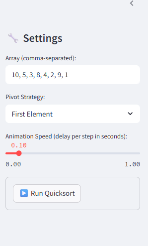
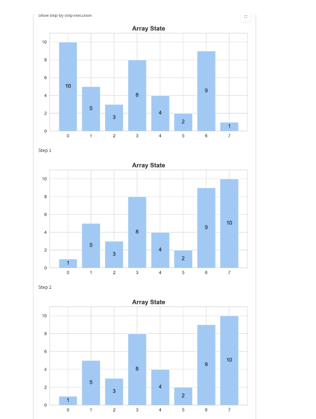
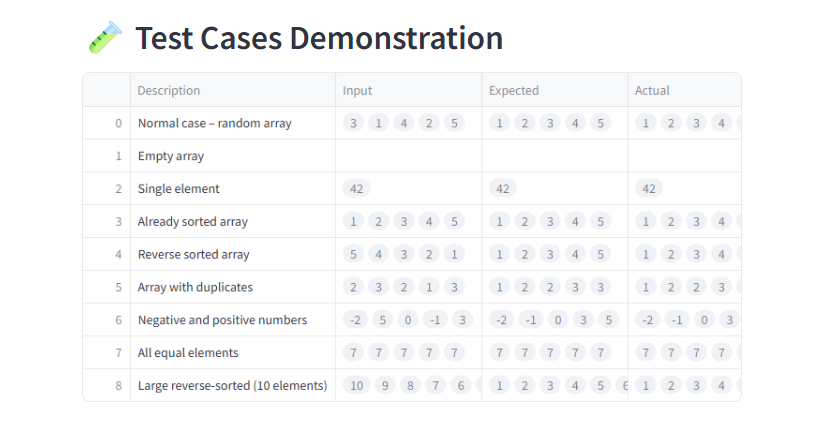
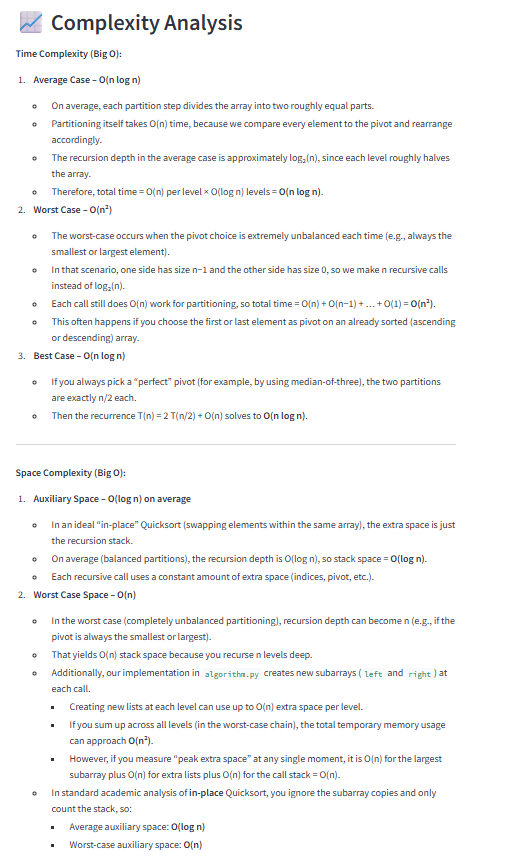

# Quicksort - Interactive Visualization

Welcome to the **Quicksort** interactive visualization project—a Streamlit web application built for the Algorithms and Programming II course at Fırat University.

---

## Project Overview

This application allows users to **step through** each comparison, swap, and recursive partition of the Quicksort algorithm in real time, making the divide-and-conquer process transparent and educational.

---

## Algorithm Description

### Problem Definition

Sort an input list of numerical values into ascending order efficiently.

### Mathematical Background

Quicksort operates by picking a **pivot** element, partitioning the list into elements less than the pivot and those greater than or equal, then **recursively** sorting each partition.

### Algorithm Steps

1. **Select Pivot:** Choose pivot (first element, random element, or median-of-three).
2. **Partition:** Reorder elements so smaller ones come before the pivot and larger ones after.
3. **Recursive Calls:** Apply Quicksort to left and right sublists around the pivot.
4. **In-Place Merge:** No merge step needed since sorting is performed in-place.

### Pseudocode

```plaintext
function quicksort(arr, low, high):
    if low < high:
        p = partition(arr, low, high)
        quicksort(arr, low, p - 1)
        quicksort(arr, p + 1, high)

function partition(arr, low, high):
    pivot = arr[high]
    i = low - 1
    for j from low to high - 1:
        if arr[j] < pivot:
            i = i + 1
            swap(arr[i], arr[j])
    swap(arr[i + 1], arr[high])
    return i + 1
```

---

## Complexity Analysis

* **Best Case Time:** O(n log n) — perfectly balanced partitions
* **Average Case Time:** O(n log n) — random pivots yield balanced splits on average
* **Worst Case Time:** O(n²) — highly unbalanced partitions (e.g., sorted input with poor pivot choice)
* **Space Complexity:** O(log n) — recursion stack for balanced partitions (up to O(n) in worst case)

---

## Features

* **Pivot Strategy:** First element, Random, Median-of-three
* **Step-By-Step Animation:** Adjustable speed slider
* **Performance Metrics:** Execution time, swap & comparison count
* **Test Cases:** Predefined scenarios (empty, single element, duplicates, reverse-sorted)

---

## Screenshots

1. **Settings Panel**
   
   *Enter a comma-separated array, choose pivot strategy, and adjust animation speed.*

2. **Main Visualization**
   
   *Execution time, total steps recorded, and animated “Array State” bar chart.*

3. **Step-by-Step Explanation**
   
   *Textual log of each step showing intermediate array states and visited elements.*

4. **Test Cases Demonstration Table**
   
   *Predefined test cases with columns: Description, Input, Expected, Actual, and Result.*

5. **Complexity Analysis Section**
   ---
   
   ---
   *Big O time and space complexity details for the Quicksort implementation.*

---

## Installation

```bash
git clone https://github.com/your-username/your-repo.git
cd your-repo
pip install -r requirements.txt
streamlit run app.py
```

---

## Usage Guide

1. Enter or generate an array in the **Settings** sidebar.
2. Select pivot strategy and animation speed.
3. Click **Run Quicksort** to visualize sorting.
4. Use step controls to review each recursive call.

### Example Inputs

* `[3, 6, 1, 8, 4]` → `[1, 3, 4, 6, 8]`
* `[]` → `[]`
* `[7, 7, 7, 7]` → `[7, 7, 7, 7]`

---

## Implementation Details

* **algorithm.py:** Core Quicksort & partition functions with step logging
* **app.py:** Streamlit interface & animation logic
* **utils.py:** Matplotlib defaults for consistent visuals

---

## Testing

Run:

```bash
pytest test_algorithm.py
```

---

## Live Demo

[Streamlit Cloud Deployment](https://share.streamlit.io/your-username/your-repo)

---

## Limitations & Future Improvements

* **Current Limitations:** May slow down for very large arrays (>1000 elements)
* **Future Improvements:** Introduce hybrid Introsort, parallel execution, theme customization

---

## References & Resources

* Cormen et al., *Introduction to Algorithms*, 3rd Ed.
* Visualgo.net Quicksort Tutorial

---

## Author

**Lami Alharkuş** | Student ID: 220543605 | GitHub: LameeALharkosh

---

## Acknowledgements

Thanks to Assoc. Prof. Ferhat UÇAR for guidance and support.
